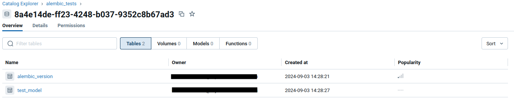

# Proper Schema Migration in Databricks with Alembic

## Introduction
In Databricks, data is typically managed within tables, where columns can be defined using various Spark data types (e.g., StringType, FloatType, IntegerType, etc.). When working with Spark, you can either explicitly define a schema (by casting columns to desired types) or allow the schema to be inferred from the data itself (e.g., inferring types from CSV field values). If you are using Delta Lake, this schema is strictly enforced during write operations. For example, attempting to write an integer into a string column would result in an error.

This setup works well in a stable environment, where the data source and schema are consistent. You can read the data, define its schema, and write it to a Databricks table in Unity Catalog without issues. But what happens if the structure of your input data changes? You might need to:

    Change the type of a column
    Add a new column with non-nullable values (on existing data)
    Rename a column
    …and more

Databricks does offer a schema evolution feature that works during write operations, attempting to merge the incoming schema with the existing one in storage. However, this process is implicit, and you won’t know if the schemas are truly compatible until you attempt to write the data. This can lead to uncertainty when handling schema changes.

## So isn’t there a better way to do this? 
In the world of software development, maintaining an up-to-date and consistent database schema is crucial. As applications evolve, the structure of the underlying database often needs to be adjusted to accommodate new features, changes in data models, or optimizations. This is where Alembic, a lightweight database migration tool for SQLAlchemy, comes into play.

Alembic allows developers to manage database schema changes systematically and explicitly through version-controlled migration scripts. These scripts define the steps required to upgrade (or downgrade) the schema, ensuring that changes to the database are applied in a controlled and predictable manner. Alembic tracks the state of the schema over time, making it easier to evolve the database alongside your application.

At the core of Alembic's functionality are migration scripts that detail specific changes to be applied to the database, such as creating tables, adding columns, or modifying data types. Developers write these scripts using Alembic's Python-based API, which generates the SQL commands needed for the database change.

In many cases, applications define an ORM (Object-Relational Mapping) model that represents how data is structured within the application code. Alembic migrations ensure that the actual database schema remains in sync with these ORM models as they evolve. Let’s walk through a simple Alembic example to illustrate how this works.

```
class SomeModel(SqlModel):
	field1: str
```
In this case, the first migration would create a table based on the defined model. Using Alembic, this might be done with the following script:

```
def upgrade():
	op.create_table() … etc
```

If we later want to modify this model by adding another field, we would update the ORM as follows:

```
class SomeModel(SqlModel):
	field1: str
	field2: str | None 
```

To keep the database in sync, we would then write another migration to add the new column to the table:

```
def upgrade():
	op.add_column()
```

This is a simple demonstration of how schema migrations are managed with Alembic in Python. It is widely used in backend applications that rely on relational databases like PostgreSQL or MySQL.

For more in-depth tutorials on setting up Alembic and using it effectively, you can refer to:

https://thinhdanggroup.github.io/alembic-python/
https://medium.com/@johnidouglasmarangon/using-migrations-in-python-sqlalchemy-with-alembic-docker-solution-bd79b219d6a

## Can we do Alembic schema migrations with Databricks? 
You can probably see how schema migrations would be just as useful for analytics tables as they are for traditional databases. To bring this functionality to Databricks, we need support for SQLAlchemy, which is the most widely used ORM framework in Python. Fortunately, Databricks recently introduced its own SQLAlchemy dialect, making it possible to integrate SQLAlchemy's migration capabilities directly with Databricks.

This new support is included in the [Databricks SQL connector](https://docs.databricks.com/en/dev-tools/python-sql-connector.html) for Python, allowing you to manage schema changes in your Databricks tables using tools like Alembic, just as you would with any other SQL database.


## Setup in Databricks
To get started with the code in [this repository](https://github.com/DaanRademaker/sample-databricks-alembic), follow these steps:

1. **Create a test schema**: Set up a test schema within a catalog in your Databricks workspace. Alembic will manage tables within this schema but not the entire catalog.

2. **Set up a SQL warehouse**: Create a SQL warehouse that Alembic can use to interact with your schema during migrations.

3. **Create a new catalog**: For testing purposes, create a catalog (e.g., `alembic_tests`). This catalog will be used for integration tests. During each test run, a temporary schema will be created within this catalog to run the migration tests, and it will be automatically deleted afterward.


## Configuring environment variables
To connect to Databricks, you need to configure the environment variables listed in the `.env_sample` file. These variables are required for running the scripts.

- **DATABRICKS_TOKEN**: A personal access token (PAT) that grants access to Databricks resources. Ensure the user or principal that generated this token has permissions to create tables in the schema you wish to manage, with read and write privileges. More information on setting up a personal access token can be found [here](https://docs.databricks.com/en/dev-tools/auth/pat.html).
- **DATABRICKS_SERVER_HOSTNAME**: The URL of your Databricks workspace. This can be found in the connection details of your SQL warehouse or cluster.
- **DATABRICKS_SERVER_PORT**: Typically set to `443` when using a SQL warehouse.
- **DATABRICKS_HTTP_PATH**: The HTTP path found in the connection details of the SQL warehouse or cluster.
- **DATABRICKS_CATALOG**: The catalog that contains the schema you want Alembic to manage.
- **DATABRICKS_SCHEMA**: The schema where the tables managed by Alembic will reside.
- **DATABRICKS_ALEMBIC_TEST_SCHEMA**: The name of the catalog where `pytest-alembic` will run test migrations.

To load these environment variables into your shell, simply run:

```bash
source .env_sample
```

## Using this package
If you have setup the environment variables above we can prepare to run the revisions

First we need to install the python package. For this we are using poetry. 
To install poetry please refer to the docs [here](https://python-poetry.org/docs/) (I recommend using pipx)

To install the packages please run
```
poetry install --with dev
```

## The Model Schema
In this project, I used SQLModel, which allows you to define SQLAlchemy models using Pydantic. The ORM model, representing the state of the model at the head revision, is named `TestModel`.

```
import sqlalchemy as sa
from databricks.sqlalchemy import TIMESTAMP
from sample_databricks_alembic.orm.models import Base


class TestModel(Base):
    """
    Table containing observations information
    """

    __tablename__ = "test_model"
    __application_name__ = "some_application"
    bigint_col = sa.Column(sa.BigInteger, primary_key=True)
    string_col = sa.Column(sa.String)
    tinyint_col = sa.Column(sa.SmallInteger())
    int_col = sa.Column(sa.String)
    numeric_col = sa.Column(sa.Numeric(10, 2))
    boolean_col = sa.Column(sa.Boolean)
    date_col = sa.Column(sa.Date)
    datetime_col = sa.Column(TIMESTAMP)
    datetime_col_ntz = sa.Column(sa.DateTime)
    time_col = sa.Column(sa.Time)
    uuid_col = sa.Column(sa.Uuid)
    some_added_column = sa.Column(sa.String, nullable=True)
    some_added_column_non_nullable = sa.Column(sa.String, nullable=False)

```

The Alembic revisions required to achieve this TestModel can be found in the Alembic module located at sample_databricks_alembic/orm/alembic/scripts/versions. These revisions are executed in sequence to reach the final model state. Of course all of these steps can also be executed in 1 revision, but to give you some idea of how revisions would come one after the other over time I split it up in multiple revisions. 

- **2023_11_13_1916-b37e86d5acf7_first_database_revision.py**: This revision creates the table with the appropriate column types.
- **2024_01_19_1441-48ffcc7ba93e_revision_2.py**: This revision adds a new column with a different type (string) and transfers the data from the original integer column to this new column. The original column is then dropped, and the new column is renamed to match the original column's name, effectively changing the column's type. This is achieved using plain SQL statements.
- **2024_01_19_1516-68c1ef671ef7_revision_3.py**: This revision adds a new nullable column.
- **2024_01_19_1533-d08b29de2ae7_revision_4.py**: This revision adds a new non-nullable column. Initially, the column is added as nullable, a default value is set for existing rows, and then the column is altered to be non-nullable using SQLAlchemy commands.

## Running the integration tests first!
The awesome thing about alembic is that we can have integration tests that check whether or not the database revisions we
want to apply to the schema are actually feasible. To run these test we can use a very nice python package called pytest-alembic
which exposes a couple of nice tests for us. 

- test_alembic_single_head_revision. There can only be one head revision.
- test_alembic_upgrade. Test that the revision can be run through from base to head
- test_alembic_up_down_consistency. Assert that all downgrades succeed. If an incompatible downgrade was added on purpose
- test_alembic_model_definitions_match_ddl. Make sure that our ORM models match the final state of the head revision


To run the tests. Make sure the environment variables of the .env_sample file are available in the shell.
```
poetry run pytest tests
```

If you are running this for the first time, this command can take a while as your sqlwarehouse might be starting up.
If all tests succeed that means we are ready to run our database migrations for the real deal!

While the tests are running you might see something like the below in your alembic_test catalog (the catalog used for the pytest runs)


<p align="center">A tmp schema with some tables for each test run</p>


## Running the actual revisions
We have a CLI available with which we can start runnings some revisions described above

```
poetry run sample-databricks-alembic --help
```


Let's start with the upgrade command. We will run all alembic revisions. (make sure you source the .env file!)
Again, if the SqlWarehouse is not started yet running this command might take some time (we have to wait for the warehouse to start)

```
poetry run sample-databricks-alembic orm tables upgrade
```
What does Alembic do during this process? It connects to Databricks and checks the alembic_version table. Based on the version recorded in this table, Alembic performs the necessary downgrades and upgrades. If no version is present, Alembic will sequentially apply all revisions from the first to the last, executing the steps outlined in each revision. Once the upgrade is complete, the schema of your tables will match the state defined in your ORM model code.


<p align="center">The alembic revision created 2 tables. The alembic_revision tables if for alembic
to track which revision the schema is currently the latest. The test_model is the table we have defined in the schema revisions</p>


<p align="center">The latest schema revision (or the head revision) in the alembic_version table</p>


<p align="center">This is the actual output of creating the test_model with the alembic revisions. The 
columns have the types we expect when we compare this to the model in the code</p>


## Why is This Approach Beneficial?

- **Consistent Schema Management:** Using Alembic provides a structured method for managing schema changes incrementally. It encourages thoughtful consideration of how schema modifications will impact existing data and offers a framework for implementing these changes effectively.

- **Unified Data Access:** Developers can rely on the ORM model as the single source of truth for data structures. This model not only simplifies understanding what data is available but also ensures that data types are consistently applied throughout the codebase, especially when using SQLAlchemy for queries.

- **Enhanced Reliability with Unit Testing:** By incorporating unit tests for schema upgrades, you gain greater confidence that your schema changes will execute correctly. This testing capability reduces risks associated with releasing and deploying projects, ensuring smoother transitions and more reliable updates.


## Caveats
- **Limited Type Support:** The current SQLAlchemy integration does not support advanced data types such as `STRUCT()`, `MAP()`, or `ARRAY()`. This limitation means that handling nested or complex data structures is not feasible with the existing `databricks-sql-alchemy` setup. As a result, this tool is best suited for managing flat tables.

- **Increased Complexity:** The fine-grained control offered by SQLAlchemy introduces additional complexity. Developers need to be well-versed in SQLAlchemy to effectively manage and manipulate the ORM models. This requirement necessitates a solid understanding of SQLAlchemy's capabilities and limitations to achieve the desired outcomes.

## Conclusion
At our company, support for `StructType` is crucial for fully integrating this solution into our production environment. Once this feature is available, we are excited to incorporate it into our production pipelines. It will offer a more reliable and consistent interface for managing schema changes, significantly enhancing our confidence when implementing updates to critical applications. If you have any questions or need further information, please feel free to connect with me on [LinkedIn](https://www.linkedin.com/in/daanrademaker). If you also want to implement this in your projects, but really need support for the missing types please upvote [this](https://github.com/databricks/databricks-sql-python/issues/321#issuecomment-2135986237) gitub issue!


